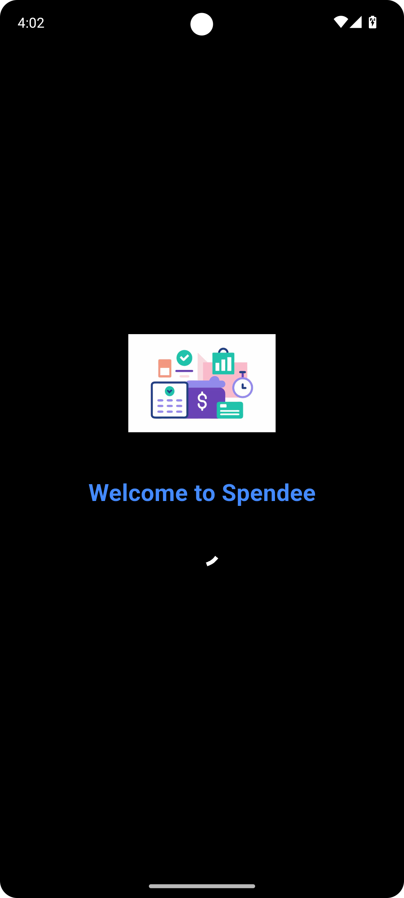
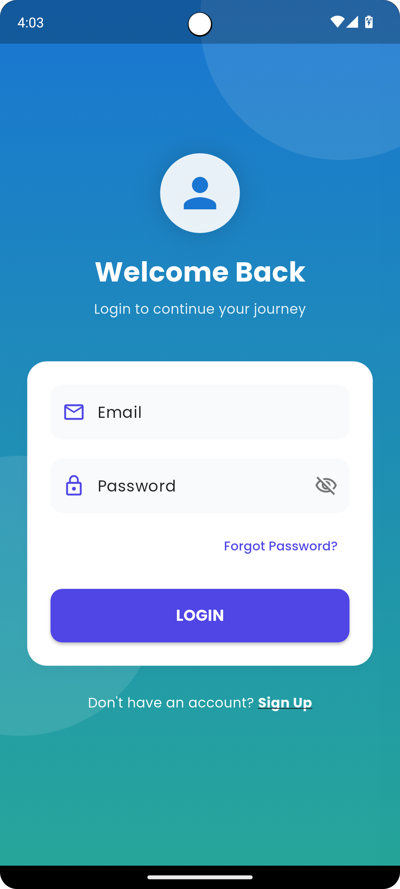
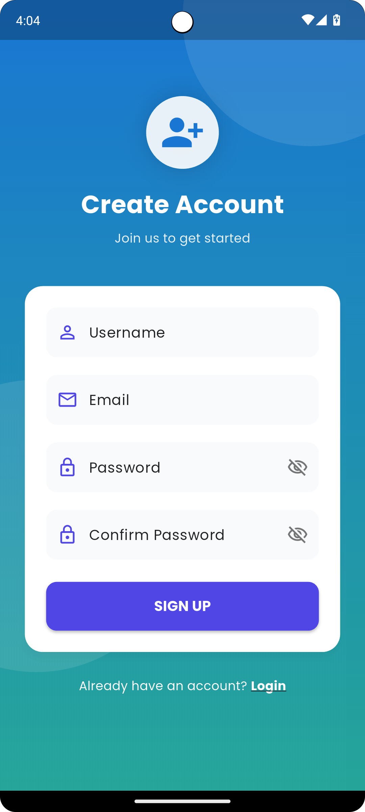
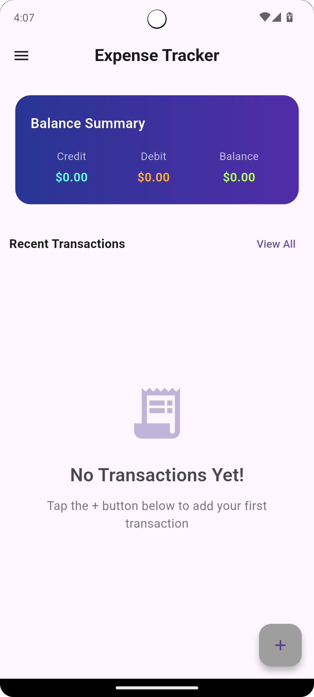
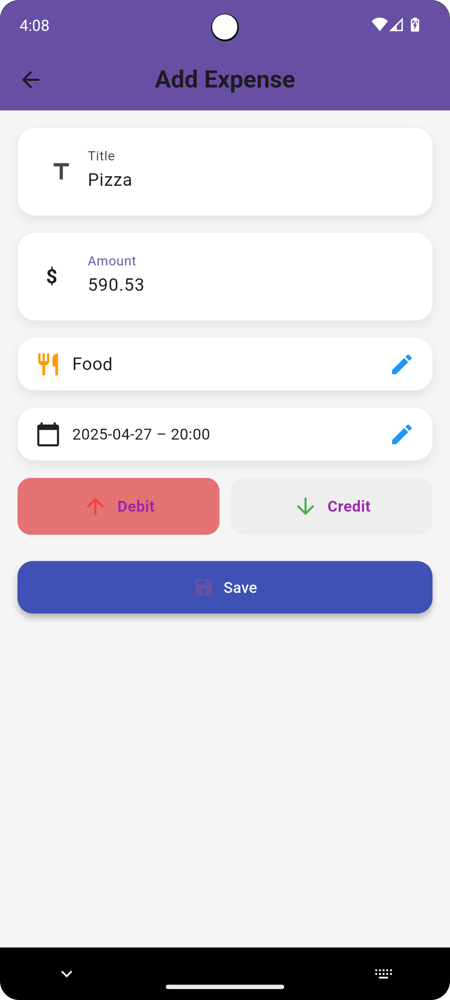
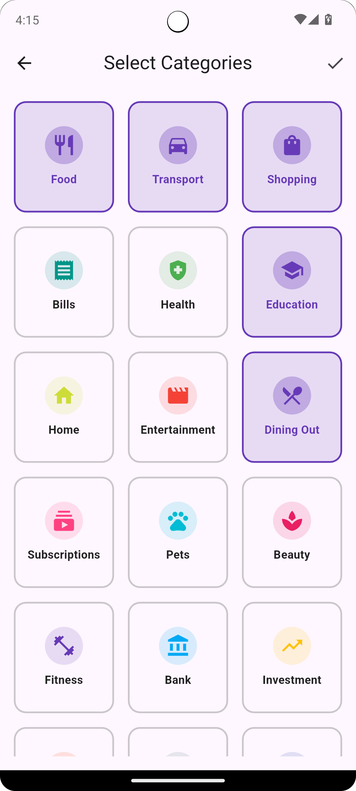
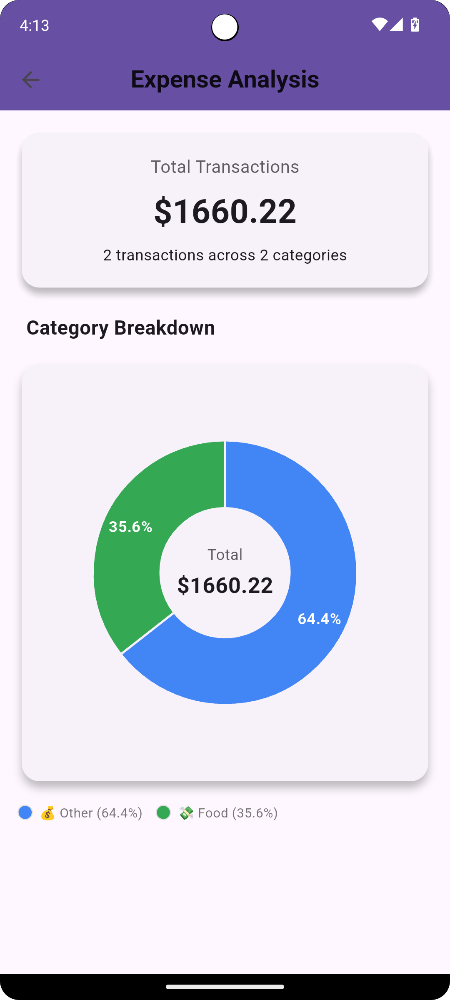
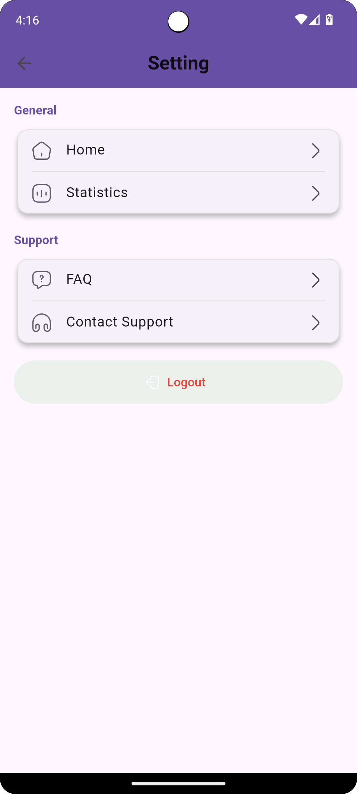

# Loop Expense Tracker

Loop Expense Tracker is a Flutter mobile app for tracking daily income and expenses. It includes Firebase authentication, local SQLite storage, category-based transaction management, analytics charts, filters, and multi-currency support.

## Overview

This project helps users:

- Create an account and log in securely
- Add credit and debit transactions
- Organize expenses by category
- Filter transactions by date, category, and amount
- View balance summaries
- Analyze spending with charts
- Store preferred currency locally

## Features

- Firebase email/password authentication
- Splash screen with auto-login check
- Sign up, login, and forgot password flow
- Add, edit, and delete transactions
- Credit and debit support
- Category picker for transactions
- Multi-currency selection
- Expense filtering by:
  - Date range
  - Category
  - Minimum and maximum amount
- Transaction history screen
- Expense chart with category breakdown
- Settings page with FAQ, support, and logout

## Tech Stack

- Flutter
- Dart
- Firebase Authentication
- Cloud Firestore
- SQLite (`sqflite`)
- Shared Preferences
- `fl_chart`
- `google_fonts`

## Project Structure

```text
lib/
  main.dart
  splash_screen.dart
  login_page.dart
  signup_page.dart
  forgot_password_page.dart
  home_page.dart
  add_expense_page.dart
  view_all_expenses_page.dart
  filter_expense_page.dart
  expense_chart.dart
  settings_page.dart
  expense_database.dart
  expense_model.dart
  expense_category.dart
  category_picker_page.dart
  CurrencySelectorPage.dart
  SelectCategoriesPage.dart
```

## Screenshots

Add your app screenshots inside `docs/screenshots/` with the exact filenames below:

- `splash-screen.png`
- `login-screen.png`
- `signup-screen.png`
- `home-screen.png`
- `add-expense-screen.png`
- `all-expenses-screen.png`
- `filter-screen.png`
- `chart-screen.png`
- `settings-screen.png`

After you add them, this section will show correctly on GitHub:

| Splash | Login | Signup |
|---|---|---|
|  |  |  |

| Home | Add Expense | All Expenses |
|---|---|---|
|  |  |  |

| Filter | Chart | Settings |
|---|---|---|
|  |  |  |

## Prerequisites

Before running this project, make sure you have:

- Flutter SDK installed
- Android Studio or VS Code
- Flutter and Dart extensions
- A running Android emulator or physical device
- A Firebase project

## Installation

### 1. Clone the repository

```bash
git clone <your-repository-url>
cd loop
```

### 2. Install dependencies

```bash
flutter pub get
```

### 3. Firebase setup

This project already contains:

- `android/app/google-services.json`

You still need to verify your Firebase project settings and platform setup.

For iOS, add:

- `ios/Runner/GoogleService-Info.plist`

Also make sure Firebase Authentication and Cloud Firestore are enabled in the Firebase Console.

### 4. Run the project

```bash
flutter run
```

## How the App Works

### Authentication

- Users sign up with username, email, and password
- Users log in with Firebase Authentication
- Forgot password sends a password reset email

### Expense Storage

- Expense data is stored locally using SQLite
- Each expense is connected to the logged-in user's `uid`
- Currency preference is stored using Shared Preferences

### Analytics

- The app calculates credit, debit, and balance
- Pie charts display category-wise transaction breakdown

## Main Screens

### Splash Screen

Checks whether the user is already logged in and redirects to the correct page.

### Login Page

Allows users to log in using email and password.

### Signup Page

Allows users to create an account and stores user details in Firestore.

### Home Page

Displays:

- Balance summary
- Recent transactions
- Navigation drawer
- Access to filters, chart, settings, and currency selector

### Add Expense Page

Lets the user:

- Enter title
- Enter amount
- Choose category
- Select date and time
- Mark transaction as credit or debit

### View All Expenses Page

Shows the full transaction list with edit and delete options.

### Filter Expense Page

Filters transactions by:

- Date range
- Category
- Minimum amount
- Maximum amount

### Expense Chart Page

Displays visual analytics using a pie chart.

### Settings Page

Includes:

- Home shortcut
- Statistics
- FAQ
- Contact support
- Logout

## Commands

```bash
flutter pub get
flutter analyze
flutter run
flutter build apk
```

## GitHub Upload Instructions

### If you want this file as your main GitHub README

1. Keep this file in the project root.
2. Rename `README_GITHUB.md` to `README.md`, or copy its content into your main `README.md`.
3. Push the project to GitHub.

### If you want screenshots to show on GitHub

1. Open the folder `docs/screenshots/`
2. Add your screenshots using the exact filenames listed in the Screenshots section
3. Commit and push the images to GitHub
4. GitHub will automatically render them inside the README

## Suggested Screenshot Order

Take screenshots in this order:

1. Splash screen
2. Login screen
3. Signup screen
4. Home screen
5. Add expense screen
6. All expenses screen
7. Filter screen
8. Chart screen
9. Settings screen

## Notes

- Android Firebase config is already present in the repository
- iOS Firebase config is not currently included
- The app uses local SQLite storage for expense records

## License

This project currently does not include a license file.
